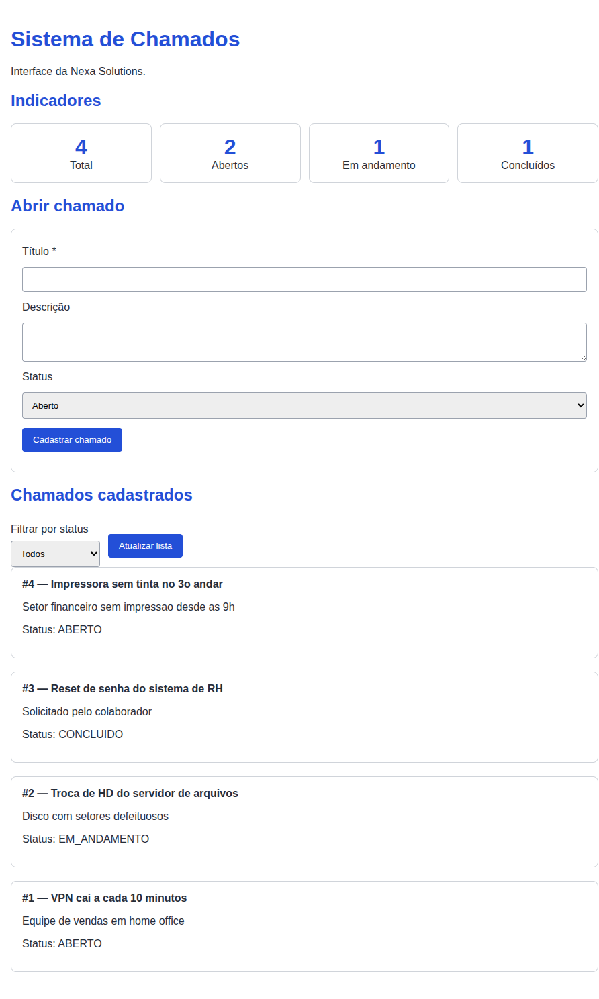

# Sistema de Chamados — Nexa Solutions

API REST em Django + Django REST Framework para abertura e acompanhamento de
chamados internos de suporte, com interface web simples e ambiente
containerizado com Docker Compose e PostgreSQL.

Este repositório é o resultado da atividade de **Manutenção e Evolução de
Software**: partindo de um repositório-base com falhas intencionais, foram
aplicadas manutenções corretiva, evolutiva, adaptativa e preventiva. As
demandas originais estão em [`docs/issues.md`](docs/issues.md) e o histórico do
trabalho está nas issues e Pull Requests do repositório.



---

## Sumário

- [Tecnologias](#tecnologias)
- [Estrutura do projeto](#estrutura-do-projeto)
- [Como executar](#como-executar)
- [Como executar os testes](#como-executar-os-testes)
- [Endpoints da API](#endpoints-da-api)
- [Variáveis de ambiente](#variáveis-de-ambiente)
- [O que foi corrigido e implementado](#o-que-foi-corrigido-e-implementado)
- [Decisões técnicas](#decisões-técnicas)
- [Evidências de validação](#evidências-de-validação)
- [Comandos úteis](#comandos-úteis)
- [Solução de problemas](#solução-de-problemas)

---

## Tecnologias

| Camada | Tecnologia |
| --- | --- |
| Linguagem | Python 3.12 |
| Framework | Django 5.x |
| API | Django REST Framework 3.15 |
| Banco de dados | PostgreSQL 16 (em container) |
| Driver | psycopg 3 |
| Frontend | HTML + CSS + JavaScript (sem framework) |
| Infraestrutura | Docker e Docker Compose |

---

## Estrutura do projeto

```text
nexa-solutions/
├── backend/
│   ├── config/               # settings, urls, wsgi/asgi do projeto Django
│   ├── chamados/             # app de chamados
│   │   ├── migrations/       # 0001_initial, 0002_alter_chamado_titulo
│   │   ├── models.py         # modelo Chamado
│   │   ├── serializers.py    # validação de entrada da API
│   │   ├── views.py          # listagem/criação, detalhe e indicadores
│   │   ├── urls.py           # rotas de /api/
│   │   └── tests.py          # suíte automatizada (11 testes)
│   ├── requirements.txt
│   └── manage.py
├── frontend/
│   └── index.html            # interface servida pelo Django em /
├── docs/
│   ├── issues.md             # demandas originais da empresa
│   ├── README.md             # enunciado do repositório-base
│   └── evidencias/           # capturas e saídas de validação
├── .env.example              # modelo de configuração (versionado)
├── .env                      # configuração real (NÃO versionado)
├── .dockerignore
├── .gitignore
├── Dockerfile
├── docker-compose.yml
└── README.md
```

---

## Como executar

### Pré-requisitos

- [Docker](https://docs.docker.com/get-docker/)
- Docker Compose v2 (`docker compose`, incluído no Docker Desktop e no
  `docker-compose-plugin` no Linux)

Não é necessário ter Python, Django ou PostgreSQL instalados na máquina.

### Passo 1 — clonar o repositório

```bash
git clone https://github.com/BrunoPolaski/nexa-solutions.git
cd nexa-solutions
```

### Passo 2 — criar o arquivo `.env`

O arquivo `.env` **não é versionado** (contém segredos). Crie-o a partir do
modelo:

```bash
cp .env.example .env
```

> **Windows (PowerShell):** `Copy-Item .env.example .env`

Para gerar uma chave secreta própria:

```bash
python -c "import secrets; print(secrets.token_urlsafe(50))"
```

e substitua o valor de `DJANGO_SECRET_KEY` no `.env`.

> A aplicação **falha ao iniciar** se `DJANGO_SECRET_KEY` não estiver definida.
> Isso é intencional: um valor padrão embutido no código seria exatamente o
> problema que a demanda INC-05 pediu para remover.

### Passo 3 — subir o ambiente

```bash
docker compose up --build
```

O Compose sobe dois serviços:

| Serviço | Imagem | Porta | Descrição |
| --- | --- | --- | --- |
| `db` | `postgres:16-alpine` | interna | Banco de dados, com volume `postgres_data` |
| `api` | build local | `8000` | Django + DRF, servindo a API e a interface |

O serviço `api` só inicia depois que o `db` passa no healthcheck
(`pg_isready`), e as migrações são aplicadas automaticamente no start.

### Passo 4 — acessar

| Recurso | URL |
| --- | --- |
| Interface web | <http://localhost:8000/> |
| API de chamados | <http://localhost:8000/api/chamados/> |
| Indicadores | <http://localhost:8000/api/indicadores/> |
| API navegável (DRF) | <http://localhost:8000/api/chamados/> no navegador |
| Admin do Django | <http://localhost:8000/admin/> |

Para encerrar: `Ctrl+C` e, se quiser remover os containers, `docker compose down`.

---

## Como executar os testes

Com o ambiente no ar (ou pelo menos após um `docker compose up --build`):

```bash
docker compose run --rm api python manage.py test
```

Saída esperada:

```text
Found 11 test(s).
Creating test database for alias 'default'...
...........
----------------------------------------------------------------------
Ran 11 tests in 0.096s

OK
```

Com detalhamento de cada caso:

```bash
docker compose run --rm api python manage.py test -v 2
```

Para rodar apenas uma classe de testes:

```bash
docker compose run --rm api python manage.py test chamados.tests.IndicadoresTests
```

Os testes usam um banco temporário (`test_nexa_chamados`), criado e destruído
automaticamente pelo Django — os dados de desenvolvimento não são afetados.

### O que é testado

| Classe | Casos | Demanda |
| --- | --- | --- |
| `ChamadoCriacaoTests` | criação válida; sem título; título vazio; título só com espaços | INC-01 |
| `ChamadoFiltroStatusTests` | sem filtro; filtro válido; caixa baixa; filtro inválido; filtro vazio | INC-02 |
| `IndicadoresTests` | base vazia; base populada | INC-06 |

---

## Endpoints da API

Base: `http://localhost:8000/api/`

### `GET /api/chamados/`

Lista os chamados, do mais recente para o mais antigo.

**Parâmetro de consulta opcional:**

| Parâmetro | Valores | Descrição |
| --- | --- | --- |
| `status` | `ABERTO`, `EM_ANDAMENTO`, `CONCLUIDO` | Filtra pelo status. Aceita caixa baixa. Ausente ou vazio = todos. |

```bash
curl http://localhost:8000/api/chamados/
curl "http://localhost:8000/api/chamados/?status=ABERTO"
```

**200 OK**

```json
[
  {
    "id": 2,
    "titulo": "VPN cai a cada 10 minutos",
    "descricao": "Equipe de vendas em home office",
    "status": "ABERTO",
    "criado_em": "2026-09-03T16:55:41.120356-03:00",
    "atualizado_em": "2026-09-03T16:55:41.120370-03:00"
  }
]
```

**400 Bad Request** — status inexistente:

```json
{"status": ["Status inválido. Valores aceitos: ABERTO, EM_ANDAMENTO, CONCLUIDO."]}
```

### `POST /api/chamados/`

Cria um chamado.

| Campo | Tipo | Obrigatório | Observação |
| --- | --- | --- | --- |
| `titulo` | string (máx. 150) | **sim** | Não aceita vazio nem apenas espaços |
| `descricao` | string | não | |
| `status` | string | não | Padrão: `ABERTO` |

```bash
curl -X POST http://localhost:8000/api/chamados/ \
  -H "Content-Type: application/json" \
  -d '{"titulo":"Impressora sem tinta","descricao":"Setor financeiro","status":"ABERTO"}'
```

**201 Created** — retorna o chamado criado.

**400 Bad Request** — título ausente ou em branco:

```json
{"titulo": ["O título é obrigatório."]}
```

### `GET /api/chamados/<id>/`

Retorna um chamado específico. **404** se não existir.

### `PUT` / `PATCH` `/api/chamados/<id>/`

Atualiza um chamado. As mesmas regras de validação do `POST` se aplicam.

```bash
curl -X PATCH http://localhost:8000/api/chamados/1/ \
  -H "Content-Type: application/json" \
  -d '{"status":"CONCLUIDO"}'
```

### `GET /api/indicadores/`

Retorna o volume de chamados por status.

```bash
curl http://localhost:8000/api/indicadores/
```

**200 OK**

```json
{"total": 4, "abertos": 2, "em_andamento": 1, "concluidos": 1}
```

---

## Variáveis de ambiente

Definidas em `.env` (a partir de `.env.example`) e lidas pelo Compose e pelo
Django.

| Variável | Obrigatória | Padrão | Descrição |
| --- | --- | --- | --- |
| `DJANGO_SECRET_KEY` | **sim** | — | Chave secreta do Django. Sem ela a aplicação não inicia. |
| `DEBUG` | não | `False` | `True` em desenvolvimento. **Use `False` em produção.** |
| `ALLOWED_HOSTS` | não | `localhost,127.0.0.1` | Hosts aceitos, separados por vírgula. |
| `CSRF_TRUSTED_ORIGINS` | não | vazio | Origens confiáveis para CSRF, separadas por vírgula. |
| `POSTGRES_DB` | não | `nexa_chamados` | Nome do banco. |
| `POSTGRES_USER` | não | `nexa_user` | Usuário do banco. |
| `POSTGRES_PASSWORD` | não | vazio | Senha do banco. |
| `POSTGRES_HOST` | não | `db` | Host do banco. O Compose força `db`. |
| `POSTGRES_PORT` | não | `5432` | Porta do banco. |

> **Nenhum segredo real está versionado.** `.env` está no `.gitignore` e no
> `.dockerignore`; `.env.example` contém apenas valores de exemplo.

---

## O que foi corrigido e implementado

| Demanda | Tipo de manutenção | Situação | PR |
| --- | --- | --- | --- |
| INC-01 — cadastro sem título | Corretiva | Concluída | #9 |
| INC-02 — filtro por status | Evolutiva | Concluída | #10 |
| INC-03 — documentação | Preventiva | Concluída | #13 |
| INC-04 — ambiente Docker | Adaptativa / Preventiva | Concluída | #8 |
| INC-05 — segredos expostos | Preventiva | Concluída | #8 |
| INC-06 — indicadores | Evolutiva | Concluída | #11 |
| INC-07 — testes automatizados | Preventiva | Concluída | #12 |

### INC-01 — cadastro sem título (corretiva)

O campo era opcional em duas camadas: `blank=True` no modelo e
`required=False, allow_blank=True` no serializer. A API aceitava e gravava
chamados sem identificação.

Corrigido nas duas camadas — só o serializer deixaria o banco aceitando string
vazia por outros caminhos (admin, shell, `loaddata`). A resposta agora é
**400** com `{"titulo": ["O título é obrigatório."]}`, válido também para
`PUT`/`PATCH`.

### INC-02 — filtro por status (evolutiva)

`ChamadoListCreateView` passou a usar `get_queryset()` com o parâmetro opcional
`?status=`. Valor inválido devolve **400** com a lista de valores aceitos, em
vez de uma lista vazia silenciosa.

### INC-03 — documentação (preventiva)

Este README, com execução, testes, endpoints, variáveis de ambiente, decisões
técnicas e evidências.

### INC-04 — ambiente Docker (adaptativa / preventiva)

O `Dockerfile` não instalava dependências e o `docker-compose.yml` tinha apenas
o serviço da aplicação. Agora há PostgreSQL em container com volume nomeado,
healthcheck, `depends_on: condition: service_healthy` e migrações automáticas
no start.

### INC-05 — segredos expostos (preventiva)

`SECRET_KEY` estava fixada no código e o banco era SQLite local. Tudo passou a
vir de variáveis de ambiente, os validadores de senha do Django foram
reativados e a aplicação falha explicitamente se a chave não estiver definida.

### INC-06 — indicadores (evolutiva)

Endpoint `GET /api/indicadores/` e painel na interface, ambos entregues. As
quatro contagens saem de um único `aggregate()`.

### INC-07 — testes automatizados (preventiva)

Suíte com 11 testes cobrindo criação válida, cadastro sem título, filtro por
status e indicadores.

### Correções incidentais

- Criada a migração inicial do app `chamados`, que **não existia** no
  repositório-base — sem ela o banco não podia ser criado.
- Removido `backend/config/backend-chamados-admin.py`: arquivo duplicado e
  quebrado (`from .models import Chamado` dentro de `config/`, pacote que não
  tem `models`).
- Corrigido XSS na listagem do frontend: `titulo` e `descricao` eram
  interpolados diretamente em `innerHTML`.
- Frontend passou a exibir a mensagem de validação devolvida pela API, em vez
  de um "Erro ao cadastrar chamado" genérico.

---

## Decisões técnicas

**PostgreSQL 16 Alpine.** Imagem pequena, versão estável e com `pg_isready`
disponível para o healthcheck.

**`psycopg[binary]` (psycopg 3).** Driver recomendado pelo Django 5. A variante
`binary` traz os binários compilados, dispensando `gcc` e `libpq-dev` na imagem
— o build fica menor e mais rápido que com `psycopg2`.

**Healthcheck em vez de script de espera.** `condition: service_healthy` no
`depends_on` resolve a corrida de inicialização sem `wait-for-it.sh` nem
`sleep` no entrypoint. É o próprio Compose orquestrando, sem código extra.

**Migrações no `CMD`, não em entrypoint separado.** O banco já está saudável
quando o container da aplicação inicia, então `migrate && runserver` basta.

**Filtro escrito à mão em vez de `django-filter`.** Para um único campo, a
dependência não se paga — e o `DjangoFilterBackend` devolve lista vazia em
valor inválido, quando a INC-02 pede tratamento explícito. As poucas linhas de
`get_queryset()` entregam o **400** e não adicionam dependência.

**Valores de status lidos de `Chamado.Status.values`.** A view e a mensagem de
erro derivam do modelo, então acrescentar um status novo não exige tocar na
view.

**Um `aggregate()` para os indicadores.** `Count("id", filter=Q(status=...))`
resolve as quatro contagens em uma consulta, em vez de quatro `.count()`.

**Django serve o `frontend/index.html`.** A página e a API ficam na mesma
origem, o que dispensa CORS e permite URLs relativas (`/api/...`) — o frontend
funciona em qualquer host, não só em `localhost:8000`.

**Bind mount de `./backend` e `./frontend` no Compose.** Sem ele,
`docker compose run api python manage.py test` executaria o código da imagem,
ignorando alterações no working tree. Também habilita o autoreload do
`runserver`.

**`runserver` e não Gunicorn.** O escopo é um ambiente de desenvolvimento
avaliável com `docker compose up --build`. Para produção, o próximo passo seria
trocar o `CMD` por Gunicorn, `DEBUG=False` e `collectstatic` com WhiteNoise ou
Nginx.

---

## Evidências de validação

Registros completos em [`docs/evidencias/`](docs/evidencias/).

### Ambiente iniciado do zero

```console
$ docker compose down -v
$ docker compose up --build
 Container nexa-db      Started
 Container nexa-db      Waiting
 Container nexa-db      Healthy
 Container nexa-api     Started
nexa-api  |   Applying chamados.0001_initial... OK
nexa-api  |   Applying chamados.0002_alter_chamado_titulo... OK
nexa-api  | Starting development server at http://0.0.0.0:8000/
```

### Comportamento da API

```console
$ curl -X POST /api/chamados/ -d '{"descricao":"sem titulo"}'
{"titulo":["O título é obrigatório."]}                       HTTP 400

$ curl -X POST /api/chamados/ -d '{"titulo":"   ","descricao":"x"}'
{"titulo":["O título é obrigatório."]}                       HTTP 400

$ curl -X POST /api/chamados/ -d '{"titulo":"Impressora sem tinta",...}'
{"id":1,"titulo":"Impressora sem tinta",...}                 HTTP 201

$ curl "/api/chamados/?status=ABERTO"
[2 chamados, ambos ABERTO]                                   HTTP 200

$ curl "/api/chamados/?status=INVALIDO"
{"status":["Status inválido. Valores aceitos: ..."]}         HTTP 400

$ curl /api/indicadores/
{"total":4,"abertos":2,"em_andamento":1,"concluidos":1}      HTTP 200
```

### Testes

```console
$ docker compose run --rm api python manage.py test
Ran 11 tests in 0.096s

OK
```

### Persistência do volume

```console
$ docker compose down          # sem -v: o volume é preservado
$ docker compose up
$ curl /api/indicadores/
{"total":4,"abertos":2,"em_andamento":1,"concluidos":1}      # dados mantidos
```

---

## Comandos úteis

```bash
# Subir em segundo plano
docker compose up --build -d

# Acompanhar os logs da aplicação
docker compose logs -f api

# Parar os containers (mantém os dados)
docker compose down

# Parar e APAGAR o banco (volume incluído)
docker compose down -v

# Criar um superusuário para o /admin/
docker compose run --rm api python manage.py createsuperuser

# Abrir um shell no container da aplicação
docker compose exec api sh

# Abrir o psql no banco
docker compose exec db psql -U nexa_user -d nexa_chamados

# Gerar migrações após alterar os modelos
docker compose run --rm api python manage.py makemigrations
```

---

## Solução de problemas

**`env file .env not found`**
O `.env` não foi criado. Rode `cp .env.example .env`.

**`ImproperlyConfigured: A variável de ambiente DJANGO_SECRET_KEY não está definida`**
O `.env` existe mas está sem a variável, ou está vazia. Confira a linha
`DJANGO_SECRET_KEY=` no arquivo.

**`bind: address already in use` na porta 8000**
Outro processo já usa a porta. Encerre-o ou altere o mapeamento em
`docker-compose.yml` para, por exemplo, `"8001:8000"`.

**`connection refused` ao banco**
Normalmente o healthcheck já cobre isso. Se persistir, verifique o estado com
`docker compose ps` e os logs com `docker compose logs db`.

**Alteração no código não aparece**
Código Python e o HTML são montados por bind mount e recarregam sozinhos. Mas
mudanças em `requirements.txt` ou no `Dockerfile` exigem
`docker compose up --build`.

**Banco em estado inconsistente**
`docker compose down -v && docker compose up --build` recria o volume do zero.
**Atenção: isso apaga todos os chamados cadastrados.**
